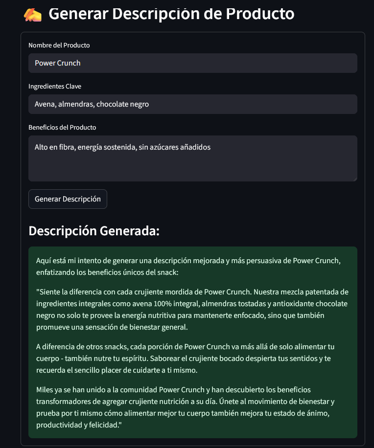
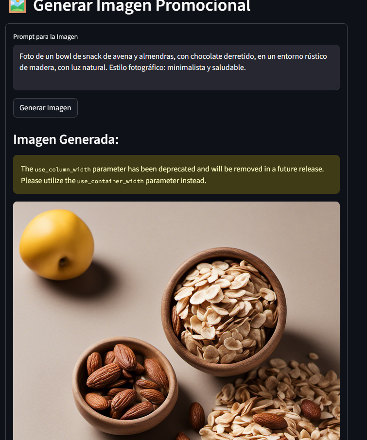

# Proyecto:  - IAGen para Lanzamiento de Productos 

Este proyecto es una solución diseñada con el objetivo de acelerar el proceso de lanzamiento de nuevos productos, en este caso, snacks saludables. Utiliza Inteligencia Artificial Generativa (IAGen) para automatizar el análisis de feedback de clientes y la generación de descripciones de producto.

## Contexto : Revolucionando el Marketing de Contenidos con IAGen

El panorama del marketing de contenidos con Inteligencia Artificial Generativa (IAgen) ha evolucionado drásticamente, pasando de instrucciones simples a enfoques más sofisticados que aprovechan las capacidades avanzadas de los sistemas de IA modernos. Se prevé que para 2025, casi un tercio de todas las comunicaciones de marketing de las principales marcas serán generadas por tecnologías de IAgen, que son capaces de producir contenido único y personalizado a gran escala en diversos formatos como texto e imágenes. Esto permite la personalización de descripciones de productos en e-commerce, adaptándose a segmentos de clientes para mejorar la experiencia y reducir costos operativos. Sin embargo, un desafío crítico es la percepción de autenticidad del consumidor, ya que estudios en la industria restaurantera revelaron que la autenticidad de la marca y la imagen percibida fueron significativamente menores cuando el contenido fue generado por IAgen en comparación con el contenido creado por humanos. La IAgen puede inducir "reacciones negativas en los seguidores" si se percibe que reemplaza el "toque humano"

l panorama del marketing de contenidos ha evolucionado drásticamente con la Inteligencia Artificial Generativa (IAg), que permite la producción de contenido único y personalizado en diversos formatos como texto e imágenes (Abdalla et al., 2025), incluyendo descripciones de productos para e-commerce adaptadas a segmentos de clientes ([Author links open overlay panel], 2025). Sin embargo, un desafío crítico es la percepción de autenticidad por parte del consumidor, ya que estudios indican que la marca y la imagen percibida son significativamente menores cuando el contenido es generado por IAg en comparación con el creado por humanos, lo que puede provocar reacciones negativas si se percibe que se reemplaza el "toque humano" (Brüns & Meißner, 2024; Abdalla et al., 2025). Para mitigar esta problemática y refinar la calidad y el cumplimiento de criterios específicos de autenticidad y engagement, la "Mejora Recursiva a través de la Auto-Crítica" (RSIP) se presenta como la técnica de prompt más adecuada, permitiendo que el modelo de IA critique y mejore sus propias salidas de forma iterativa (Critical-Elephant630, 2024).


## Características Principales

    * Análisis Automatizado de Feedback: Un flujo de trabajo serverless procesa los comentarios de los clientes casi en tiempo real, extrayendo el sentimiento, las entidades clave y resumiendo el feedback utilizando modelos de IAGen.

    * Dashboard Interactivo: Una aplicación web ligera construida con Streamlit visualiza los datos procesados, mostrando métricas, gráficos de sentimiento y tendencias.

    * Generador de Descripciones: La aplicación incluye una herramienta que permite a los equipos de marketing generar descripciones de producto atractivas y coherentes a partir de prompts sencillos.
---

## Arquitectura Técnica

La solución se basa en un flujo serverless y modular en AWS:

    1. Ingesta de Datos: Un script local (upload_data.py) simula la llegada de feedback subiendo archivos JSON a un bucket de AWS S3.

    2. Procesamiento:

        Un disparador de S3 activa una función AWS Lambda.

        La función Lambda utiliza Amazon Comprehend para el análisis de sentimiento y Amazon Bedrock para la generación de resúmenes de comentarios y descripciones de producto.

    3. Base de Datos: Los comentarios procesados y sus metadatos (sentimiento, entidades, etc.) se almacenan en una tabla de Amazon DynamoDB.

    4. Frontend: Una aplicación Streamlit se conecta a DynamoDB para mostrar los datos en un dashboard y ofrecer la herramienta de generación de contenido.


### 📋 Prerequisites

Make sure you have the following installed on your **Windows** system:
* **Python 3.8+**
* **Visual Studio Code**
* **Git**

---

### 🛠️ Setup and Execution

Follow these steps to get the project up and running:

1.  **Clone the Repository**
    Open your Git Bash or CMD terminal and download the project:
    ```bash
    git clone [https://github.com/jeffersonquispe/content_marketing_ia.git](https://github.com/jeffersonquispe/content_marketing_ia.git)
    cd reto
    ```

2.  **Configure Environment Variables**
    Create a new file named `.env` in the project's root folder and add your AWS credentials. Replace the example values with your own:
    ```ini
    AWS_ACCESS_KEY_ID=your_aws_access_key_id
    AWS_SECRET_ACCESS_KEY=your_aws_secret_access_key
    AWS_REGION=us-east-1
    ```

3.  **Install Dependencies**
    It is recommended to create a virtual environment for the project.
    * Create and activate the virtual environment:
        ```bash
        python -m venv venv
        venv\Scripts\activate
        ```
    * Install the necessary libraries:
        ```bash
        pip install -r requirements.txt
        ```

4.  **Run the Application**
    To start the first Streamlit application, make sure the virtual environment is active and run the following command:
    ```bash
    $env:AWS_REGION = "us-east-1"; $env:PYTHONPATH = "...\reto\src"; streamlit run src/app/app.py
    ```
    To start the second Streamlit application with dashboard, make sure the virtual environment is active and run the following command:
    ```bash
    python .\run.py
    ```
    To upload json database to S2 bucket and start triggers with lambda:
    ```bash
    python upload_data.py
    ```
---

### 📂 Project 

La solución está organizada de manera modular para una mejor escalabilidad y mantenimiento.




### 📂 Presentacion

https://docs.google.com/presentation/d/1OL2qyyDhaniO1Ak4hwuhSCyiAKDDporq2dyNVUBHG24/edit?usp=sharing

### Próximos Pasos y Escalabilidad

    Integración con APIs de Redes Sociales: Conectar el sistema a fuentes de datos en tiempo real (ej. APIs de Instagram, Twitter) para una ingestión automática.

    Modelos de IAGen a la Medida: Refinar el análisis y la generación de contenido afinando los modelos de Bedrock con datos específicos de Alicorp.

    Monitorización y Alertas: Usar dashboards de Amazon QuickSight para una visualización avanzada y configurar alertas de problemas recurrentes detectados por la IAGen.


## Bibliografia
• Abdalla, M. J., Ali, F., Alotaibi, S., & Ali, L. (2025). Beyond the hype: Evaluating the impact of generative AI on brand authenticity, image, and consumer behavior in the restaurant industry. International Journal of Hospitality Management, 131, 104318. https://doi.org/10.1016/j.ijhm.2025.104318
• Brüns, J. D., & Meißner, M. (2024). Do you create your content yourself? Using generative artificial intelligence for social media content creation diminishes perceived brand authenticity. Journal of Retailing and Consumer Services, 79, 103790. https://doi.org/10.1016/j.jretconser.2024.103790
• Critical-Elephant630. (2024). Advanced Prompt Engineering Techniques for 2025: Beyond Basic Instructions. r/PromptEngineering. [Publicación de Reddit]. Recuperado de [La URL específica no se proporciona en la fuente original, solo la comunidad de Reddit. La fecha se infiere del texto "4 meses atrás" y el contexto del contenido].
• [Autor(es) no especificados en el extracto]. (2025). Harnessing generative AI for personalized E-commerce product descriptions: A framework and practical insights. Computer Standards & Interfaces, 94, 104012. https://doi.org/10.1016/j.csi.2025.104012